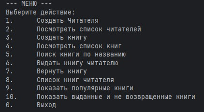
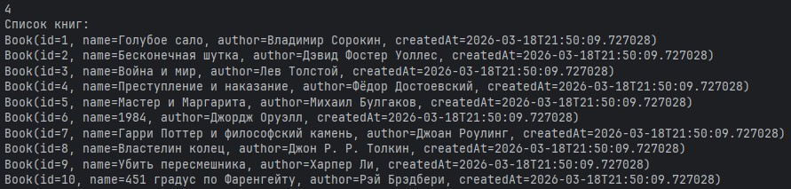
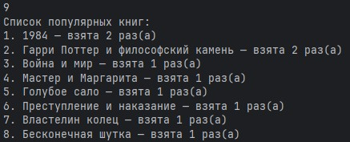

# Library-bmstu

Консольное приложение для управления библиотечным фондом и читателями.

Реализовано на Java с использованием JDBC и Spring Boot.  
  
  


## Функционал

**Книги**: добавление, просмотр списка, поиск по названию.
**Читатели**: регистрация, просмотр списка.
**Операции**: выдача книги, возврат, просмотр выданных книг конкретному читателю.
**Статистика**: популярные книги, общий список выданных книг.

## Работа с БД SQL

В папке **resources/db.migration** содержатся .sql файлы для осуществления миграций с помощью
Flyway.
В указанных файлах приведены команды по созданию таблиц и индексов.

Также в папке есть файлы с командами по наполнению таблиц тестовыми данными - тоже запустятся
автоматически после запуска контейнера и проекта.

## Технологический стек

Язык: Java 21
Фреймворк: Spring Boot 3.3.6
Доступ к данным: Spring JDBC
СУБД: PostgreSQL (миграции через Flyway)
Утилиты: Lombok, Gradle

## Требования

JDK 21
Docker
Gradle

## Запуск

1. Запустить Docker
2. Запустить БД для приложения:

```bash
docker-compose up -d 
```

3. Запустить через gradlew:

```bash
./gradlew bootRun
```

ИЛИ

запустить .jar из папки executable^

```bash
java -jar .\executable\Library-bmstu-1.0-SNAPSHOT.jar
```

После запуска автоматически создадутся таблицы и индексы в контейнере Docker при помощи миграций
через Flyway.  
Также в таблицы будут занесены тестовые данные при помощи миграций.

## Структура проекта

При проектировании старался придерживаться SOLID и основных принципов DDD (имена в доменном слое,
понятные участникам; пользовательская типизация и т.д.).

Применены паттерны проектирования:

- фабричный метод;
- фасад;
- команда.

```bash
└───main
    ├───java
    │   └───Library
    │       │   LibraryApp.java
    │       │   
    │       ├───Controller
    │       │   │   Controller.java
    │       │   │   
    │       │   └───Command
    │       │       │   BaseCommand.java
    │       │       │   Command.java
    │       │       │   CommandContext.java
    │       │       │   CommandFactory.java
    │       │       │   
    │       │       └───Impl
    │       │               CreateReadableEntityCommand.java
    │       │               CreateReaderCommand.java
    │       │               FindReadableEntity.java
    │       │               GetBorrowedByReaderCommand.java
    │       │               GetBorrowedRECommmand.java
    │       │               GetReadableEntities.java
    │       │               GetReadersCommand.java
    │       │               GetTopRECommand.java
    │       │               GiveREntityCommand.java
    │       │               ReturnREntityCommand.java
    │       │               
    │       ├───Model
    │       │   ├───Domain
    │       │   │   ├───ReadableEntity
    │       │   │   │       Book.java
    │       │   │   │       ReadableEntity.java
    │       │   │   │       
    │       │   │   ├───Reader
    │       │   │   │       Reader.java
    │       │   │   │       ReaderTxtEntity.java
    │       │   │   │       
    │       │   │   └───TextEntity
    │       │   │           Author.java
    │       │   │           Email.java
    │       │   │           Name.java
    │       │   │           TextEntity.java
    │       │   │           
    │       │   └───Factory
    │       │       ├───ReadableEntityFactory
    │       │       │       BookFactoryStringParam.java
    │       │       │       ReadableEntityFactory.java
    │       │       │       ReadableEntityParam.java
    │       │       │       
    │       │       └───ReaderFactory
    │       │               ReaderFactory.java
    │       │               ReaderFactoryStringParam.java
    │       │               ReaderParam.java
    │       │               
    │       ├───Repository
    │       │   └───LibraryRepository
    │       │           LibraryRepository.java
    │       │           PsqlRepository.java
    │       │           
    │       ├───Service
    │       │   ├───GeneralService
    │       │   │       GeneralService.java
    │       │   │       
    │       │   ├───ReadableEntityService
    │       │   │       ReadableEntityService.java
    │       │   │       
    │       │   └───ReaderService
    │       │           ReaderService.java
    │       │           
    │       └───Utils
    │           ├───IDGenerator
    │           │       IDGenerator.java
    │           │       SequentialIDGenerator.java
    │           │       SequentialNonPrefixIDGenerator.java
    │           │       
    │           └───Logging
    │                   ConsoleLogger.java
    │                   Logger.java
    │                   
    └───resources
        │   application.properties
        │   
        └───db
            └───migration
                    V1__create_table_readers.sql
                    V2__create_table_books.sql
                    V3__create_table_readers_books_connection.sql
                    V4__create_index.sql
                    V5__add_comments.sql
                    V6__create_index_to_lower.sql
                    V7__insert_test_values_readers.sql
                    V8__insert_test_values_books.sql
                    V9__insert_test_values_borrowings.sql
```  

### Автор: Anton Evgenev. tg: @tdutanton